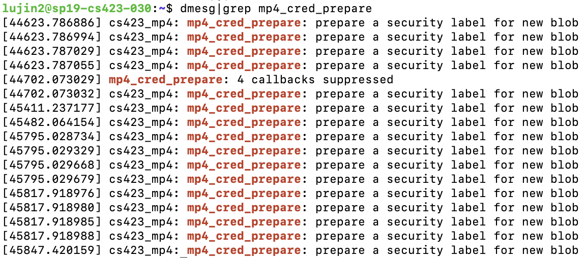
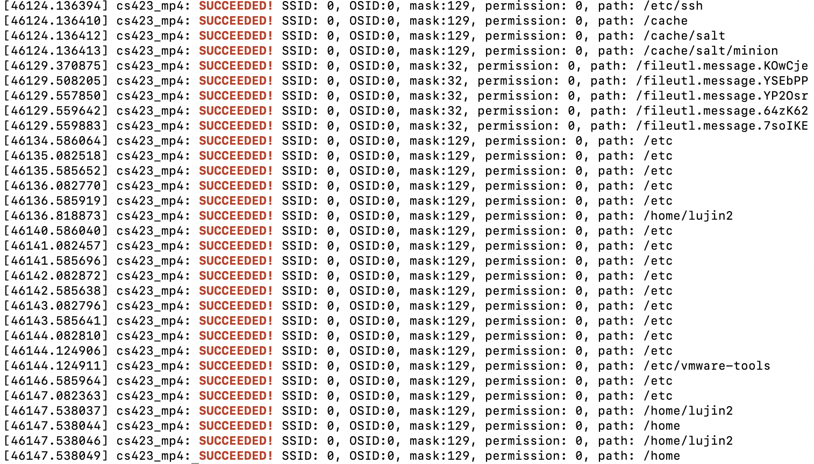

# MP4

## Part 1: Design Decision

#### 1.mp4_cred_alloc_blank
Allocate a blank mp4 security label.
First, allocate a new `mp4_security` structure and check if it exists. Then initialize its `mp4_flag` as `MP4_NO_ACCESS`. Finally, pass this cred's `security` field to the new security blob.

#### 2.mp4_cred_prepare
Very similar to `mp4_cred_alloc_blank`, this hook prepares new credentials for modification based on the implementation of the previous function. A new security blob is allocated and store the security information of the old security blob if existed. 

#### 3.mp4_cred_free
In this hook, I used `kfree` to deallocate the security blob we allocated before.

#### 4.mp4_bprm_set_creds
This part sets the credentials for a new task. There is a helper function `get_inode_sid` to get the sid of the inode of the bprm. `dentry` is used inside the helper function and be sure to `dput` this structure after the function.  
A possible reason to result in the kernel crash might be the return value of this function. We need always to return `MP4_NO_ACCESS` or `0` if there is null value in bprm or file. 
If the security flag is `MP4_TARGET_SID`, I set the current blob's sid as `MP4_TARGET_SID` as well.

#### 5.mp4_inode_init_security
This hook set the security attribute of a newly created inode. In other words, we are going to set the `name` and `value` and `len` attribute. To ensure that there is no out of memory problem for `value` and `name`, I set two temp pointers to this check.  
If the sid of the inode is `MP4_TARGET_SID`, I initilized the value as `read-write` or `dir-write`.

#### 6.mp4_inode_permission

In this hook, I checked the permission for an inode being opened. First, get the path of a valid inode and check if the path should be skip using the function `mp4_should_skip_path`.  
After that, get the sid and oid of the inode and pass into the function `mp4_has_permission`. This policy was designed based on the provided hfile. One important part is that we need to set seperate policies for target and non-target processes.

## Part 2: Test cases 
#### a. `test.perm` and `test.perm.unload`
This set of test cases are used to check the basic permission of our built kernel. I set attribute for file `read_only.txt` and `write_only` and want to know the differences of write_only and read_only modification. 

To run the tests:
Source the script: `source test.perm`  
At home directory:  
`cat read_only.txt`, `vim read_only.txt`  
`cat write_only.txt`, `vim write_only.txt`  
Unloaded script:`source test.perm.unload`

Expected Results:  
`cat read_only.txt` & `cat write_only.txt`  

`vim read_only.txt`  

`vim write_only.txt`  

`dmesg` of Denied cases  

#### b. `passwd.perm` and `passwd.perm.unload`
Using a dummy user to check the permission of the file processes.

1) Create a dummy user: `sudo adduser dummy`
2) Strace the log during the updating process: `sudo strace -o p.log passwd dummy`.  
3) Used `exract_permit.ipynb` to extract the least policy and create new test cases `passwd.perm` and `passwd.perm.unload`.  
4) Load the script and try to update the passward again. 
`source passwd.perm`  
`sudo passwd dummy`  
`source passwd.perm.unload`  
We can also check the log of this process by `sudo strace -e open -o log passwd dummy`  
The sample result after editing the password should be

## Part 3: Screenshot
Using `dmesg|grep [key word]` to check if the specific function has finished running. The screenshots for the functions I implemented are as follows.  
1) mp4_inode_init_security

2) mp4_cred_prepare

3) mp4_cred_free

4) mp4_bprm_set_creds

5) mp4_inode_permission

